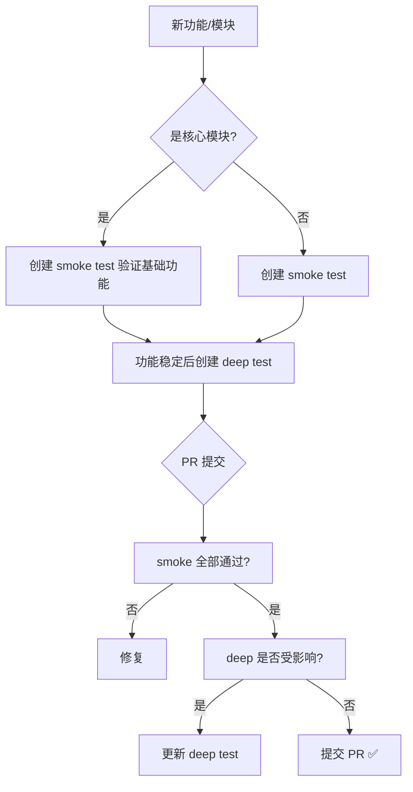

# 贡献者测试指南 — yuleOSH Contributor Testing Guide

> **版本**: v1.0.0 | **状态**: DRAFT  
> **维护人**: 小马 🐴 (质量架构师)  
> **适用对象**: 所有 yuleOSH 外部贡献者及新入组开发者  
> **最后更新**: 2026-06-14

---

## 1. 欢迎加入 yuleOSH！🎉

感谢你考虑为 yuleOSH 贡献代码。本文档是你编写测试的**入门指南**——你不需要是测试专家，但需要理解 yuleOSH 的测试文化和规范。

### 1.1 先读什么

在开始写测试前，请先浏览以下文档：

| 文档 | 了解什么 |
|:----|:---------|
| `docs/QUICKSTART.md` | 如何克隆、安装、运行 yuleOSH |
| `docs/USAGE.md` | yuleOSH 的主要功能和使用方式 |
| `docs/test-coverage-standards.md` | 测试准入标准（核心模块的覆盖率要求） |
| `docs/spec.md` | 项目规范，包含所有 SHALL/SHOULD/MAY 需求 |
| `CONTRIBUTING.md` | 贡献者行为准则和 PR 流程（见 CODE_OF_CONDUCT.md） |

### 1.2 你需要什么

- Python 3.10+
- `pip install -e ".[dev]"` (安装开发依赖)
- 一个终端和文本编辑器
- 阅读本文档约 15 分钟

---

## 2. 项目测试结构

### 2.1 目录布局

```
yuleOSH/
├── src/yuleosh/          ← 源代码
│   ├── store_pg.py       ← PostgreSQL 存储层
│   ├── ci/               ← CI/CD 引擎
│   └── ...
├── tests/                ← 测试目录
│   ├── fixtures/         ← 共享测试夹具（fixtures）
│   ├── test_store_pg_smoke.py     ← smoke test
│   ├── test_store_pg_deep.py      ← deep test
│   ├── test_ci_smoke.py           ← smoke test
│   ├── test_ci_run_deep.py        ← deep test
│   └── ...
├── pytest.ini            ← pytest 配置
└── docs/                 ← 所有文档
```

### 2.2 测试文件命名约定

```
{module}_smoke.py     → 快速验证模块是否能正常导入 + 基本功能
{module}_deep.py      → 全面覆盖每个方法的 happy path + 错误路径
{module}_extended.py  → 补充测试：边界 case、并发、压力
```

**GIVEN** 贡献者新建 `test_xxx_smoke.py`
**WHEN** pytest 收集测试文件
**THEN** 该文件中的测试 SHALL 仅验证最基本的导入和运行

**GIVEN** 贡献者新建 `test_xxx_deep.py`
**WHEN** pytest 收集测试文件
**THEN** 该文件 SHALL 覆盖目标模块的所有公共方法，包括 happy path 和 错误路径

**GIVEN** 贡献者新建 `test_xxx_extended.py`
**WHEN** pytest 收集测试文件
**THEN** 该文件 SHOULD 覆盖边界条件、并发、资源泄漏等高级场景

### 2.3 测试函数命名约定

```
test_{module}_{scenario}_{expected_result}
```

示例：

| 测试函数名 | 对应场景 |
|:-----------|:---------|
| `test_store_pg_get_organization_found` | 获取已存在的组织 |
| `test_store_pg_get_organization_not_found` | 获取不存在的组织 |
| `test_ci_run_coverage_above_threshold` | 覆盖率高于门禁 |
| `test_ci_run_coverage_below_threshold` | 覆盖率低于门禁 |
| `test_flash_runner_fallback_chain` | FlashRunner fallback 链 |

---

## 3. 如何运行测试

### 3.1 运行全部测试

```bash
# 运行所有测试（最常用）
pytest

# 运行所有测试，带覆盖率报告
pytest --cov=yuleosh --cov-report=term-missing

# 运行所有测试，覆盖率结果保存到 HTML
pytest --cov=yuleosh --cov-report=html
# 打开 htmlcov/index.html 查看可视化报告
```

### 3.2 运行特定测试

```bash
# 按测试文件
pytest tests/test_store_pg_smoke.py

# 按测试类
pytest tests/test_store_pg_smoke.py::TestStorePg

# 按测试函数
pytest tests/test_store_pg_smoke.py::TestStorePg::test_import

# 按关键词（推荐）
pytest -k "smoke"           # 运行所有 smoke 测试
pytest -k "store_pg"        # 运行所有 store_pg 相关测试
pytest -k "not smoke"       # 运行所有非 smoke 测试
pytest -k "deep and ci"     # 运行所有 ci 的 deep 测试
```

### 3.3 调试测试

```bash
# 显示详细的 pass/fail 输出
pytest -v

# 在第一个失败时停止（快速调试）
pytest -x

# 显示 print 输出
pytest -s

# 显示局部变量（失败的测试会打印 locals）
pytest --showlocals

# 运行并收集最慢的 10 个测试
pytest --durations=10
```

### 3.4 使用 pytest.ini

yuleOSH 的 `pytest.ini` 已经预设了常用配置：

```ini
[pytest]
testpaths = tests              # 测试目录
pythonpath = src               # 源代码路径（无需 PYTHONPATH）
addopts = --cov=yuleosh        # 默认带覆盖率
         --cov-report=term-missing
         --cov-report=html
         --cov-fail-under=60   # CI 门禁 60%
```

**这意味着你只需要运行 `pytest`，不需要添加额外参数！**

---

## 4. 如何编写测试

### 4.1 Smoke Test vs Deep Test

yuleOSH 将测试分为两类：**smoke test** 和 **deep test**。

#### Smoke Test（冒烟测试）

**定义**：最快速的验证，确保模块可以被导入并运行基本功能。

**什么时候用 smoke test：**

- 新模块首次创建时
- CI pipeline 快速失败阶段（L0 检查）
- 验证模块是否正常工作

**smoke test 的特点：**

| 属性 | 值 |
|:----|:----|
| 执行时间 | <5 秒 |
| 每个模块的测试数量 | 3-10 个 |
| 覆盖深度 | 仅 happy path |
| 是否需 mock 外部依赖 | 是 |
| 推荐的文件名 | `test_{module}_smoke.py` |

**smoke test 示例：**

```python
"""Smoke tests for yuleosh.store_pg — PostgreSQL store adapter."""

def test_import():
    """Smoke: module can be imported."""
    from yuleosh.store_pg import PostgresStore
    assert PostgresStore is not None
    assert hasattr(PostgresStore, '_instances')
```

```python
"""Smoke tests for yuleosh.ci.run — CI/CD engine."""

def test_import():
    """Smoke: module can be imported."""
    import yuleosh.ci.run
    assert yuleosh.ci.run is not None

def test_ci_result_creation():
    """Smoke: CIResult can be instantiated."""
    from yuleosh.ci.run import CIResult
    result = CIResult()
    assert result.stages == []
```

#### Deep Test（深度测试）

**定义**：全面覆盖每个公共方法的所有路径——happy path + 错误路径 + 边界条件。

**什么时候用 deep test：**

- 模块开发稳定后
- 发布前的质量验证
- CI pipeline Layer 1 检查

**deep test 的特点：**

| 属性 | 值 |
|:----|:----|
| 执行时间 | 视模块而定（通常 10-60 秒） |
| 每个模块的测试数量 | 50-200+ |
| 覆盖深度 | 所有路径（happy + error + boundary） |
| 是否需 mock 外部依赖 | 是 |
| 推荐的文件名 | `test_{module}_deep.py` |

**deep test 示例：**

```python
"""Deep tests for yuleosh.store_pg — full CRUD coverage."""

class TestGetOrganization:
    """get_organization 方法的完整覆盖。"""
    
    def test_found(self, store, mock_db):
        """GIVEN 存在的 org GIVEN 有效 ID WHEN get_organization THEN 返回正确对象"""
        mock_conn, mock_cursor, _ = mock_db
        mock_cursor.fetchone.return_value = (1, "test-org", "Test Org", "desc", "2026-01-01", "2026-06-01")
        mock_cursor.description = [["id"], ["key"], ["name"], ["description"], ["created_at"], ["updated_at"]]
        
        result = store.get_organization("test-org")
        assert result is not None
        assert result["key"] == "test-org"
    
    def test_not_found(self, store, mock_db):
        """GIVEN 不存在的 org WHEN get_organization THEN 返回 None"""
        mock_conn, mock_cursor, _ = mock_db
        mock_cursor.fetchone.return_value = None
        
        result = store.get_organization("nonexistent")
        assert result is None
```

### 4.2 如何选择：Smoke vs Deep



**快速决策表：**

| 你的场景 | 写什么测试 |
|:---------|:-----------|
| 新模块，第一次提交 | smoke test (3-10 个) |
| 现有模块，加一个新函数 | 在对应 deep test 文件中添加 |
| 修复了一个 bug | 在 deep test 中添加回归测试 |
| 重构了一个函数 | 更新 deep test；如果测试不变则不需要加 |
| 添加了一个辅助工具函数 | smoke test 检测导入即可 |
| 修复了安全漏洞 | 至少 1 个 deep test 覆盖攻击 case |

### 4.3 Mock 外部依赖

yuleOSH 的测试原则是**不依赖任何外部服务**。这意味着：

- **不连真实数据库**（mock psycopg2）
- **不执行真实命令**（mock subprocess.run）
- **不写真实文件**（使用 `TemporaryDirectory`）
- **不依赖真实 git**（mock git_commit_hash）

#### 示例：Mock PostgreSQL

```python
import sys
import types as _t
from unittest import mock
import pytest

# store_pg 的唯一 mock 模式
@pytest.fixture
def mock_db():
    """GIVEN mock psycopg2 环境 WHEN 测试 store_pg 方法 THEN 不连接真实数据库"""
    # 步骤 1: 重置单例
    from yuleosh.store_pg import PostgresStore
    PostgresStore._instances = {}
    PostgresStore._lock = mock.MagicMock()
    
    # 步骤 2: 创建 mock cursor
    mock_cursor = mock.MagicMock()
    mock_cursor.__enter__.return_value = mock_cursor  # 关键：支持 with 语句
    mock_cursor.fetchone.return_value = None
    mock_cursor.fetchall.return_value = []
    mock_cursor.rowcount = 0
    
    # 步骤 3: 创建 mock connection
    mock_conn = mock.MagicMock()
    mock_conn.closed = False
    mock_conn.cursor.return_value = mock_cursor
    
    # 步骤 4: mock psycopg2 模块
    mock_psycopg2 = mock.MagicMock()
    mock_psycopg2.connect.return_value = mock_conn
    
    # 步骤 5: 注入到 sys.modules
    with mock.patch.dict("sys.modules", {"psycopg2": mock_psycopg2}):
        yield mock_conn, mock_cursor, mock_psycopg2

@pytest.fixture
def store(mock_db):
    """创建 PostgresStore 实例。"""
    from yuleosh.store_pg import PostgresStore
    return PostgresStore(dsn="pg://test:test@localhost:5432/test")
```

#### 示例：Mock subprocess

```python
# ci/run.py 的测试模式
def test_command_success():
    """GIVEN subprocess 返回 0 WHEN run_subprocess THEN 返回成功结果"""
    with mock.patch("yuleosh.ci.run.subprocess.run") as mrun:
        mrun.return_value.returncode = 0
        mrun.return_value.stdout = "build successful"
        mrun.return_value.stderr = ""
        
        # 调用被测试函数
        from yuleosh.ci.run import _run_subprocess
        result = _run_subprocess(["make", "all"], timeout=30)
        
        # 验证
        assert result.returncode == 0
        assert "build successful" in result.stdout
```

### 4.4 测试编写原则（GIVEN/WHEN/THEN）

所有测试 SHALL 使用 GIVEN/WHEN/THEN 思路编写：

```python
def test_get_organization_not_found(self, store, mock_db):
    """GIVEN 不存在的 org key WHEN get_organization THEN 返回 None"""
    mock_conn, mock_cursor, _ = mock_db
    # GIVEN：准备测试前置条件
    mock_cursor.fetchone.return_value = None
    
    # WHEN：执行被测试方法
    result = store.get_organization("nonexistent")
    
    # THEN：验证结果
    assert result is None
    mock_cursor.execute.assert_called_once()
    mock_conn.commit.assert_called_once()
```

**GIVEN** 一个测试需要验证异常路径
**WHEN** 测试编写完成
**THEN** 每个 `if/else` 分支 SHALL 至少有一个测试覆盖

### 4.5 验证覆盖率

```bash
# 查看特定文件的覆盖率
pytest tests/test_store_pg_deep.py --cov=yuleosh.store_pg --cov-report=term-missing

# 查看所有未覆盖的行
pytest --cov=yuleosh --cov-report=term-missing | grep "MISSED"

# 生成 HTML 报告（可视化最佳）
pytest --cov=yuleosh --cov-report=html
open htmlcov/index.html  # macOS
```

**CI 门禁**：`--cov-fail-under=60`（当前阶梯 L0），逐步提升。

---

## 5. 测试规范清单

### 5.1 测试文件规范

| # | 要求 | 等级 |
|:--|:-----|:----:|
| T01 | 测试文件 SHALL 以 `test_` 开头 | SHALL |
| T02 | smoke 测试文件 SHALL 以 `_smoke.py` 结尾 | SHOULD |
| T03 | deep 测试文件 SHALL 以 `_deep.py` 结尾 | SHOULD |
| T04 | 每个测试函数 SHALL 有 docstring 描述场景 | SHALL |
| T05 | 每个测试函数 SHALL 遵循 GIVEN/WHEN/THEN 思路 | SHALL |
| T06 | 测试函数名 SHALL 格式为 `test_{scenario}_{expected}` | SHALL |
| T07 | 每个测试 SHALL 独立、不依赖其他测试 | SHALL |
| T08 | 测试 SHALL 不修改全局状态（mock 需本地化） | SHALL |
| T09 | 关键路径（if/else）SHALL 有正向和反向测试 | SHALL |
| T10 | 外部依赖 SHALL 被 mock，不连真实服务 | SHALL |

### 5.2 Docstring 规范

每个测试函数的 docstring SHALL 包含以下格式：

```
"""{req_id}: {简要描述}

GIVEN {前置条件}
WHEN {触发条件}
THEN {预期结果}
"""
```

示例：

```python
def test_store_pg_get_session_expired(self, store, mock_db):
    """SWR-012.3: 获取过期 session 返回 None
    
    GIVEN 一个已过期的 session
    WHEN get_session 被调用
    THEN 返回 None 并记录过期日志
    """
    ...
```

### 5.3 新增测试的流程

```
1. 确定目标模块 → src/yuleosh/xxx.py
2. 检查 tests/ 中是否有对应的 smoke/deep 文件
   ├─ 有 → 追加到现有文件
   └─ 无 → 创建 test_xxx_smoke.py（3-10 个基础测试）
3. 为每个公共方法编写：
   ├─ 1 个 happy path 测试（正常路径）
   └─ 至少 1 个 error path 测试（异常/不存在/失败）
4. 本地运行验证
   ├─ pytest -k "xxx"    → 你的测试全部通过
   └─ pytest --cov=xxx   → 覆盖率符合目标
5. 提交 PR
```

### 5.4 store_pg 测试清单（模板）

为 `store_pg.py` 中的每个方法添加测试：

```
create_organization         → 成功插入 + 返回 id
get_organization            → 找到 | 未找到
get_organization_by_id      → 找到 | 未找到
list_organizations          → 返回列表
create_user                 → 默认 role | 指定 role
get_user                    → 找到 | 未找到
get_user_by_id              → 找到 | 未找到
list_users                  → 返回列表
create_org_project          → 默认 desc | 自定义 desc
get_session                 → 有效 | 过期 | 未找到
delete_session              → DELETE 执行
cleanup_expired_sessions    → DELETE 执行
```

每个方法至少 2 个测试（happy + not found），复杂的 ≥3 个。

### 5.5 ci/run 测试清单（模板）

```
CIResult         → init, add_stage, complete, to_dict
Git helpers      → git_commit_hash, get_changed_files
File discovery   → find_test_files, cache key
Layer deps       → JSON 解析, config fallback
Coverage helpers → skip reason, load_coverage_json, run_coverage
_run_subprocess  → 成功 | 失败 | 超时 | 异常
run_unit_tests   → 有测试发现 | 无测试 | 全部失败
run_coverage     → 高于阈值 | 低于阈值 | 运行失败
run_sil_tests    → 无 ELF | 通过 | 失败
main()           → 各层 CL | 无参数 | 退出码
```

---

## 6. CI Pipeline 测试流程

### 6.1 CI 中的测试层次

```
Pipeline 入口 (PR/Commit)
│
├─ ⚡ L0: smoke test (快速失败)
│    pytest -k "smoke" -x --timeout=60
│    目的: 5 分钟内发现基本错误
│
├─ 🔬 L1: full unit test + coverage gate
│    pytest --cov=yuleosh --cov-fail-under=60
│    目的: 全面验证 + 覆盖率门禁
│
├─ 🔗 L2: integration + SIL
│    交叉编译 + 仿真 + 静态分析
│
├─ 🖥️ L2.5: HIL (mock mode)
│    硬件在环 mock
│
└─ 📦 L3: E2E + evidence pack
     系统测试 + 合规证据打包
```

### 6.2 什么测试在 CI 中运行

| CI 阶段 | 运行的测试 | 时间目标 |
|:--------|:-----------|:--------:|
| L0 (smoke) | `pytest -k "smoke"` | < 5 min |
| L1 (unit) | `pytest -k "not smoke"` — 所有 deep + extended | < 20 min |
| L2+SIL | SIL 仿真测试 | < 30 min |
| HIL | 硬件在环（可选 mock） | < 30 min |
| L3 (E2E) | 端到端系统测试 | < 15 min |

---

## 7. 常见问题 (FAQ)

### Q1: 我该为我的 PR 写 smoke 还是 deep？

- **第一次提交新模块** → 先写 smoke test（证明模块至少能导入）。
- **为现有模块添加功能** → 在 deep test 文件中添加。
- **修复 bug** → 在 deep test 文件中添加**回归测试**（先验证 bug 存在，再修复，再验证修复成功）。

### Q2: 测试很慢怎么办？

- 使用 `-k` 只运行相关测试：`pytest -k "store_pg"`
- smoke test 应该非常快（<5 秒每个文件）
- deep test 慢是正常的，CI 会并行运行

### Q3: 我不知道怎么 mock 怎么办？

- 查看已有的 mock 模式：`tests/test_store_pg_deep.py` 和 `tests/test_ci_run_deep.py`
- store_pg 模式 → mock `psycopg2` 模块 + mock cursor
- ci/run 模式 → mock `subprocess.run` + mock `git_commit_hash`
- 其他外部依赖同理

### Q4: 覆盖率下降怎么办？

- 运行 `pytest --cov=yuleosh --cov-report=term-missing` 查看未覆盖的行
- 如果没有写测试覆盖修改的代码，补上测试
- 如果添加了新功能却没有测试，添加 smoke test 至少验证导入

### Q5: CI 上我的测试通过了但覆盖率降低了？

- 可能新代码行未被测试覆盖
- 运行 `pytest --cov-report=term-missing` 查看新增的 MISSED 行
- 为这些行添加测试

### Q6: 什么是 "rogue test"？

- 没有关联任何需求 ID 的测试
- CI 会检测并标记为警告
- 解决方案：在测试函数名或 docstring 中加入需求 ID

---

## 8. 快速参考

### 8.1 常用命令速查

```bash
# 开发——日常使用
pytest                                    # 运行全部测试
pytest -k "smoke"                         # 仅 smoke
pytest -k "store_pg"                      # 仅 store_pg 相关
pytest -x -v                              # 第一个失败停止 + 详细输出

# 覆盖率
pytest --cov=yuleosh --cov-report=term-missing    # 终端覆盖率报告
pytest --cov=yuleosh --cov-report=html             # HTML 覆盖率报告

# CI 模拟
bash ci/rtm-verify.sh                      # RTM 门禁验证
pytest --cov-fail-under=60                 # 覆盖率门禁

# 调试
pytest -s --showlocals                     # 显示 print + 局部变量
pytest --durations=10                      # 最慢的 10 个测试
```

### 8.2 测试文件模板

**smoke test 模板：**

```python
"""Smoke tests for yuleosh.{module_name}."""
import pytest


class Test{ModuleName}Smoke:
    """Smoke verification for {module_name}."""
    
    def test_import(self):
        """Smoke: module can be imported."""
        from yuleosh import {module_name}
        assert {module_name} is not None
    
    def test_{basic_feature}(self):
        """Smoke: basic feature works."""
        ...
```

**deep test 模板：**

```python
"""Deep tests for yuleosh.{module_name}."""
import pytest
from unittest import mock


class Test{MethodName}:
    """{method_name} 方法的完整覆盖。"""
    
    def test_happy_path(self, {fixtures}):
        """GIVEN {precondition} WHEN {trigger} THEN {expected}"""
        ...
    
    def test_error_path(self, {fixtures}):
        """GIVEN {failure condition} WHEN {trigger} THEN {expected failure}"""
        ...
    
    def test_boundary(self, {fixtures}):
        """GIVEN {boundary value} WHEN {trigger} THEN {expected behavior}"""
        ...
```

---

## 附录 A: 现有测试文件索引

| 测试文件 | 覆盖模块 | 类型 | 行数 |
|:---------|:---------|:----:|:----:|
| `test_store_pg_smoke.py` | store_pg | smoke | 20 |
| `test_store_pg_deep.py` | store_pg | deep | 87 tests |
| `test_ci_smoke.py` | ci/run | smoke | 15 |
| `test_ci_run_deep.py` | ci/run | deep | 132 tests |
| `test_ci_run_extended.py` | ci/run | extended | 50+ |
| `test_flash.py` | cross/flash | deep | 30+ |
| `test_spec_smoke.py` | spec/engine | smoke | 10 |
| `test_spec_engine.py` | spec/engine | deep | 60+ |
| `test_plugins_smoke.py` | plugins | smoke | 10 |
| `test_api_smoke.py` | api | smoke | 10 |
| `test_llm_smoke.py` | llm | smoke | 8 |

## 附录 B: 版本历史

| 版本 | 日期 | 变更 |
|:----|:----|:-----|
| v1.0.0 | 2026-06-14 | 初始版本：测试结构、运行方法、编写指南、Smoke vs Deep 决策 |

---

*每个贡献者都是 yuleOSH 质量共同体的一部分。一个测试现在可能为你节省明天的一小时调试时间。祝编码愉快！🐴*
