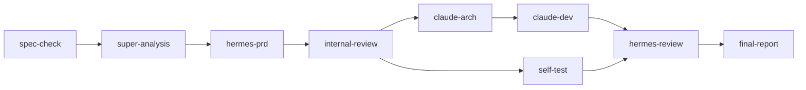

# yuleOSH ASPICE V-Model 架构与测试分析 — 小克 👨‍💻

> **日期**: 2026-06-08  
> **版本**: yuleOSH v0.2.0  
> **范围**: ASPICE V-Model 右半侧 (SWE.4/SWE.5/SWE.6 → SYS.4/SYS.5/SYS.6)

---

## 目录

1. [执行摘要](#1-执行摘要)
2. [测试架构深度分析](#2-测试架构深度分析)
3. [嵌入式专属测试缺失分析](#3-嵌入式专属测试缺失分析)
4. [自动化测试策略设计](#4-自动化测试策略设计)
5. [AI Pipeline 可测试性](#5-ai-pipeline-可测试性)
6. [CI/CD 效率优化](#6-cicd-效率优化)
7. [技术债务清单](#7-技术债务清单)
8. [行业对标与改进路线](#8-行业对标与改进路线)
9. [行动计划总结](#9-行动计划总结)

---

## 1. 执行摘要

yuleOSH v0.2.0 的核心架构正确——3 层 CI/CD 流水线对应了 ASPICE V-Model 右半侧的基本结构，追溯矩阵和证据链引擎也符合 ASPICE 审计要求。然而，**当前实现有大量「影子架构」的问题**：CI 流水线的关键步骤（交叉编译、MISRA 静态分析、HIL/SIL 适配）在代码层面有骨架，但在测试基础设施和实际执行层面处于「跳过」状态。这是最大的风险。

**整体评估**: 架构思路正确，落地深度不足约 70%。需要从「工具链验证平台」向「真正的嵌入式 CI/CD」进化。

---

## 2. 测试架构深度分析

### 2.1 当前 3 层 CI/CD 与 ASPICE 映射

| ASPICE 实践 | yuleOSH 层级 | 当前实现 | 覆盖度 |
|-------------|-------------|----------|--------|
| SWE.4 软件单元验证 | Layer 1 (Dev Verify) | `pytest` + `coverage` + `clang-tidy` — 但 clang-tidy 如果未安装则静默跳过 | ⚠️ 骨架存在，实际执行管道脆弱 |
| SWE.5 软件集成与集成测试 | Layer 2 (Integration Verify) | `cross-compile` + `cppcheck` + `integration-tests` + `memory-safety` — 交叉编译和 ASan 均为 info/skipped | ❌ 基本缺失 |
| SWE.6 软件合格性测试 | Layer 3 (System Verify) | `e2e-tests` + `version-check` + `evidence-pack` — E2E 测试仅 12 个，大量条件跳过 | ⚠️ 薄弱 |
| SYS.4 系统集成与集成测试 | Layer 2 → Layer 3 过渡 | 无系统级集成测试，没有 QEMU/BSP 模拟 | ❌ 缺失 |
| SYS.5 系统合格性测试 | Layer 3 (System Verify) | 仅证据链生成，无系统级功能验证 | ❌ 缺失 |
| SYS.6 软件发布 | Layer 3 (Release) | 版本检查 + 证据包 | ⚠️ 基础 |

### 2.2 关键问题：所有检查都是"软校验"

```python
# ci/run.py: 实际执行模式分析
try:
    result = subprocess.run(["clang-tidy"], ...)  # 跑不到就 FileNotFound → skipped
except FileNotFoundError:
    ci.add_stage("clang-tidy", "skipped", "clang-tidy not installed")
    return True  # 失败返回 True！不阻断流水线
```

**几乎每个高影响阶段都有「静默跳过」路径**：
- `clang-tidy` → `FileNotFoundError` → **skipped**, 返回 `True`
- `cppcheck` → `FileNotFoundError` → **skipped**, 返回 `True`
- `coverage` → CI 层内缓存命中失败/JSON 解析异常 → **skipped**, 返回 `True`
- `cross-compile` → 永远只有 `info` → 从不实际执行
- `memory-safety` → 仅 `info("ASan tests configured but not run")` → 永不执行

**结论**: 流水线在任何一个步骤「跳过」后仍然显示 ✅ ALL STAGES PASSED。这导致「伪合规」。

### 2.3 分层划分合理性评估

**基本合理**：Dev → Integration → System 三层结构与 ASPICE V-Model 契合。但：

1. **Layer 1 和 Layer 2 边界模糊**: `clang-tidy` 出现在 L1 但 `cppcheck` 在 L2，两者都是静态分析，应统一到 L2
2. **Layer 2 缺少真正集成内容**: 交叉编译、链接测试、接口合约测试才是真正的集成验证
3. **Layer 3 过弱**: E2E 测试、性能基准、长久稳定性测试缺失

**建议重新划分**:
- **Layer 1 (Dev Verify)**: 语法检查 + pylint/flake8 + 纯 Python 单元测试 + 覆盖门禁 (SWE.4)
- **Layer 2 (Integration Verify)**: 交叉编译验证 + 静态分析 (MISRA/cppcheck/clang-tidy) + 接口契约测试 + 内存检查 (ASan/UBSan) (SWE.5, SYS.4)
- **Layer 3 (System Verify)**: QEMU/HIL 模拟测试 + E2E 工作流 + 性能基准 + 安全扫描 + 签名打包 (SWE.6, SYS.5, SYS.6)

### 2.4 需调整的问题

- **P0** — 所有 stage 都 `return True` on skip 导致伪通过
- **P0** — CI 层之间无依赖链阻断（L2 失败应阻断 L3）
- **P1** — CI 结果存储到 `.osh/ci/layer*.json`，但无汇总 Dashboard/趋势分析
- **P1** — 测试文件的自动发现缓存仅在进程内，无持久化

---

## 3. 嵌入式专属测试缺失分析

### 3.1 当前状态

yuleOSH 的嵌入式特征主要体现在 OpenSpec 格式和 spec.md 的 Req-004 描述中。实际基础代码对嵌入式支持几乎为零：

| 特征 | 规范要求 | 实现状态 | 问题 |
|------|---------|----------|------|
| ARM/RISC-V/x86_64 交叉编译 | Spec Req-004 SHALL | Layer 2 仅 `print(f"Found {len(c_files)} C/C++ files — cross-compile ready")` | ❌ 无实际交叉编译链 |
| MISRA-C/C++ 静态分析门禁 | Spec Req-004 SHALL | Layer 1 `clang-tidy` 和 Layer 2 `cppcheck` — 但工具缺失时不报错 | ⚠️ 骨架 |
| HIL/SIL 适配层测试 | Spec Req-004 MAY | 仅 spec 里提到，"MAY" | ❌ 未实现 |
| 固件签名和 OTA 打包 | Spec Req-004 SHOULD | 未实现 | ❌ |
| QEMU 仿真测试 | 未在 spec 中 | 未实现 | ❌ |

### 3.2 嵌入式专属测试基础设施缺失清单

```
缺失模块                          严重性    影响
─────────────────────────────────────────────────────────
交叉编译链容器/镜像构建             P0        CI 无法验证嵌入式代码
MISRA 规则集配置与门禁              P0        安全关键代码无合规检查
QEMU 仿真测试框架                   P1        无系统级回归测试环境
HIL/SIL 适配层抽象接口              P2        硬件在环测试无法接入
固件签名 + OTA 包构建               P1        发布流程不完整
BSP/板级支持包层接口测试            P1        嵌入式驱动层无验证
二进制大小分析/ROM/RAM 门禁         P2        嵌入式系统资源约束无检查
实时性/延迟基准测试                  P2        无时序验证
```

### 3.3 推荐方案

**P0 — 交叉编译容器化 (Docker-based):**

```dockerfile
# cross-toolchain.dockerfile (建议添加)
FROM ubuntu:22.04 AS arm-toolchain
RUN apt-get update && apt-get install -y \
    gcc-arm-none-eabi binutils-arm-none-eabi \
    gcc-riscv64-unknown-elf \
    gcc-x86-64-linux-gnu

FROM arm-toolchain
COPY . /workspace
WORKDIR /workspace
# 多目标并行编译
RUN make TARGET=arm    all && \
    make TARGET=riscv  all && \
    make TARGET=x86_64 all
```

**P0 — MISRA 门禁策略:**

```yaml
# misra-gate.yml (CI 配置)
misra_check:
  rules: "MISRA-C:2012"
  mandatory: [10.1, 10.3, 10.4, 12.1, 12.2, 14.3, 14.4, 15.2, 15.5, 15.6, 15.7]
  error_on_violation: true   # ← 关键！现在是静默通过
  report: "misra-report.xml"
  blocker: true               # ← MISRA 失败 = 流水线失败
```

**P1 — QEMU 集成测试:**

```python
# qemu_runner.py (建议添加)
def run_qemu_test(binary: str, target: str, timeout: int = 30) -> dict:
    """在 QEMU 中运行并验证嵌入式固件。"""
    qemu_cmd = {
        "arm":    f"qemu-system-arm -M versatilepb -kernel {binary} -nographic",
        "riscv":  f"qemu-system-riscv64 -M virt -kernel {binary} -nographic",
        "x86_64": f"qemu-system-x86_64 -kernel {binary} -nographic",
    }
    result = subprocess.run(
        qemu_cmd[target].split(),
        capture_output=True, text=True, timeout=timeout
    )
    return {"passed": result.returncode == 0, "output": result.stdout}
```

---

## 4. 自动化测试策略设计

### 4.1 当前测试统计

基于代码审查：

| 测试文件 | 测试数 | 类型 | 质量评估 |
|---------|--------|------|---------|
| `test_llm_client.py` | ~20 | 单元 (mock HTTP) | ✅ 优质，覆盖全面 |
| `test_spec_engine.py` | 4 | 单元 (端到端) | ⚠️ 太少，依赖真实 spec.md |
| `test_spec_engine_extended.py` | 9 | 单元 (临时文件) | ✅ 质量高，测试独立 |
| `test_ci_engine.py` | 5 | 单元 (临时目录) | ⚠️ 仅测试数据结构 |
| `test_review_engine.py` | 5 | 单元 | ⚠️ 仅测试基础数据结构 |
| `test_evidence_engine.py` | 4 | 单元 (临时目录) | ⚠️ 路径良好但太少 |
| `test_store.py` | 6 | 单元 (SQLite 临时) | ✅ 质量好 |
| `test_e2e.py` | 12 | E2E (子进程) | ⚠️ 50% 条件跳过 |
| `test_perf.py` | 2 | 性能 | ⚠️ 仅基础基准 |
| **总计** | **~67** | | |

### 4.2 四层测试金字塔策略

#### 第 1 层：单元测试 (→ ~200+ tests)

**当前数量**: ~55 (不含 E2E)  
**目标**: 200+  
**原则**: 每个源文件 ≥ 1 测试文件，每个非 trivial 函数 ≥ 1 测试用例

覆盖缺口：
| 源模块 | 当前测试 | 需要 |
|--------|---------|------|
| `src/spec/validate.py` (450+ 行) | ~13 | → 40+ (diff, edge cases, invalid specs, unicode) |
| `src/ci/run.py` (400+ 行) | ~5 | → 30+ (各阶段错误路径, hook types, 缓存) |
| `src/evidence/pack.py` (200+ 行) | ~4 | → 20+ (ZIP 损坏, 路径缺失, 大型 spec) |
| `src/pipeline/run.py` (700+ 行) | 0（唯一的测试通过 E2E） | → 80+（LLM 内容变化时 pipeline 行为不变）|
| `src/review/run.py` (200+ 行) | ~5 | → 25+ (各 kind 的 reviewer 路由) |
| `src/llm/client.py` (150+ 行) | ~20 | 这个已经够好了 ✅ |
| `src/store.py` (400+ 行) | ~6 | → 25+ (并发, 迁移, spec 缓存) |
| `src/ui/server.py` (700+ 行) | 0 | → 30+ (HTTP 请求处理) |
| `src/api/*.py` (多个文件) | 0 | → 40+ (REST API 路由) |

**P0 建议**: 为 `pipeline/run.py` 添加独立单元测试，不依赖 LLM API。将 pipeline 步骤改为可注入模式：

```python
# 重构建议：将 LLM 调用抽象为可注入接口
class PipelineStep:
    def __init__(self, llm_client=None):
        self.llm = llm_client or chat_completion  # 可注入，便于测试
    
    def run(self, context):
        # 不使用 real LLM 即可测试逻辑
        return self.llm(self._build_prompt(context))
```

**P0 建议**: 为 `ci/run.py` 的各阶段添加 mock 测试，验证「工具缺失→返回 False」的阻断逻辑。

#### 第 2 层：集成测试 (→ 40+ tests)

**当前**: 0 个真正的集成测试  
**目标**: 40+  
**定义**: 无 mock 的真实模块间交互测试

测试矩阵：
| 集成场景 | 数量 | 说明 |
|---------|------|------|
| spec → diff → validate 流程 | 5 | 多文件 diff + 并行验证 |
| spec → pipeline 步骤链 | 10 | 各步骤输出传给下一步 |
| review → evidence 整合 | 5 | review 结果被 evidence 正确收集 |
| store → ci/pipeline/review | 5 | SQLite 持久化的 CRUD 正确性 |
| CI L1 → L2 → L3 传递性 | 5 | L2 失败是否阻断 L3？ |
| llm client → 各 step handler | 10 | 模拟 LLM 返回各种内容 |

#### 第 3 层：E2E 测试 (→ 15+ tests)

**当前**: 12（6 个通过，6 个条件跳过）  
**目标**: 15+ 稳定运行

需求改进：
- **P0**: 移除 `pytest.mark.skipif(True, ...)` 的测试桩
- **P0**: 使 E2E 测试对真实 LLM 调用的依赖可选——用预录制的 fixture 数据替代
- **P1**: 添加金标准测试（golden file testing），对比 LLM 输出结构与已知好的模式

#### 第 4 层：系统测试 (→ 10+ tests)

**当前**: 0  
**目标**: 10+

| 系统场景 | 说明 |
|---------|------|
| 完整流水线模拟 | Docker 中启动 + 模拟 spec → 验证所有产物 |
| 多用户并发 | 模拟多个 pipeline 同时运行 |
| 数据持久化恢复 | 服务重启后 pipeline/review/ci 状态一致 |
| 错误恢复 | 中途 LLM 调用失败，重试后恢复 |
| 大 spec 吞吐量 | 1000+ requirement 的 spec 处理时间 < 30s |

### 4.3 覆盖门禁提升路线

```
v0.2.0:  line 38% | branch 38%  ← 当前
v0.3.0:  line 55% | branch 45%  
v0.4.0:  line 70% | branch 60%
v1.0.0:  line 85% | branch 75%  ← ASPICE 级
```

但关键是——**覆盖率的测量对象要明确**。当前 `coverage run -m pytest` 跑的是所有代码，但覆盖率数据来自脚本文件和实际被测试文件混合。需要排除 CI 的 `run.py` 本身、UI server 等。

---

## 5. AI Pipeline 可测试性

### 5.1 当前 AI Pipeline 设计

```
spec-check (小明/本地) 
  → super-analysis (小明/LLM) 
  → hermes-prd (Hermes/LLM) 
  → internal-review (小明/本地)
  → claude-arch (Claude/LLM) 
  → claude-dev (Claude/LLM)
  → self-test (Claude/本地) 
  → hermes-review (Hermes/LLM)
  → final-report (小明/本地)
```

9 个步骤中 5 个调用 LLM。这带来三个根本问题：

### 5.2 问题 1：不可复现

LLM 输出**非确定性**。同一个 spec 两次运行可能产生不同结果。

**P0 建议 — 哈希锁定**:
```python
# 对 pipeline 运行的每次 LLM 调用进行内容哈希
pipeline_run_hash = hashlib.sha256(spec_content).hexdigest()[:12]
# 缓存 LLM 输出
llm_cache_key = f"{pipeline_run_hash}:{step_name}:{prompt_hash}"
```

**P0 建议 — 金标准回归测试**:
```python
# tests/fixtures/golden/
#   super-analysis-golden.md
#   prd-golden.md
#   architecture-golden.md
# 测试：用 mock LLM 返回 fixture → pipeline 行为不变
```

### 5.3 问题 2：LLM 依赖的测试基础设施

当前 `pipeline/run.py` 没有任何测试（test_e2e.py 中有 `test_e2e_pipeline_spec_check_only` 仅测试非 LLM 第一步）。

**P0 建议 — 使 PipelineSession + step 可独立测试**:
1. **依赖注入**: LLM client 作为参数传入，测试时注入 mock
2. **LLM 响应契约测试**: 定义 LLM 输出的 JSON Schema，验证每次返回都有必要字段
3. **Pipeline 编排测试**: 仅测试步骤逻辑（不实际调用 LLM），验证状态流转和错误处理

```python
# 重构后
class PipelineEngine:
    def __init__(self, llm_factory=None):
        self.llm = llm_factory or default_llm_factory
    
    def run_step(self, step_key, context):
        # 可 mock、可缓存、可重播
        if self._cache_hit(step_key, context):
            return self._get_cached(step_key)
        return self.step_handlers[step_key](context, self.llm)
```

### 5.4 问题 3：LLM 调用成本过大

5 步 LLM 调用中，3 步的 prompt 包含整个 spec + 前序产物，token 消耗叠加：

| 步骤 | 输入大小估算 | 输出大小 | 估算成本 ($deepseek) |
|------|-------------|---------|-------------------|
| super-analysis | spec 12K + 元数据 | ~4K tokens | ~$0.002 |
| hermes-prd | spec 12K + super 4K | ~8K tokens | ~$0.005 |
| claude-arch | spec 8K + 源码树 10K + 源码片段 15K | ~6K tokens | ~$0.010 |
| claude-dev | spec 6K + arch 4K + prd 3K + super 3K + 项目指标 | ~8K tokens | ~$0.015 |
| hermes-review | spec 5K + all artfacts 15K + 源码 24K | ~4K tokens | ~$0.020 |
| **合计** | **~100K+ token 输入** | | **~$0.052/run** |

**P1 建议**: 引入增量上下文管理器，只在变化时重新传输上下文块。

**P1 建议**: 在测试中使用 `retries=1` 和 `max_tokens=512` 减少成本和超时。

### 5.5 问题 4：Hermes review 的 JSON 契约脆弱

```python
# pipeline/run.py step_hermes_review()
# 关键代码 (line ~680-720):
json_str = raw
if "```json" in raw:
    json_str = raw.split("```json")[1]
    if "```" in json_str:
        json_str = json_str.split("```")[0]
```

这是**极其脆弱**的解析方式。LLM 很可能输出格式偏差。

**P0 建议**: 
1. 使用 `jq` 风格的树松弛 JSON 解析器
2. 在 prompt 中使用 `Response MUST be valid JSON. No markdown fences, no explanation.` 但同时也做好容错
3. 添加 JSON Schema 验证（`jsonschema` 库或手写校验）

---

## 6. CI/CD 效率优化

### 6.1 嵌入式 CI/CD 的特殊挑战

嵌入式项目的 CI/CD 比纯软件项目复杂 3-5 倍：

| 难点 | 原因 | 影响 |
|------|------|------|
| 多目标交叉编译 | ARM/RISC-V/x86_64 需要 3 套工具链 | 编译时间 3x |
| 工具链下载/缓存 | GCC for ARM (2GB+) + RISC-V (1.5GB+) | 首次 CI 运行 15+ 分钟 |
| 模拟器启动 | QEMU 启动 + 固件加载 10-30s | 集成测试慢 |
| 硬件资源有限 | 没有 CI Runner 直接连接示波器/JTAG | 无法做真实硬件测试 |
| HIL 环境租赁 | AWS Device Farm / 自建硬件集群 | 成本高 |

### 6.2 当前实现问题

```python
# ci/run.py cross-compile stage (line ~310-320)
print(f"    Found {len(c_files)} C/C++ files — cross-compile ready")
ci.add_stage("cross-compile", "info", f"{len(c_files)} files ready for ARM/RISC-V/x86")
# 返回 None → run_layer2 继续跑... 没有实际编译！
```

**交叉编译在 L2 中没有实际执行**。这是最大的 CI 效率/有效性问题。

### 6.3 行业最佳实践方案

#### GitLab CI / GitHub Actions 级联管道 (建议架构)

```yaml
# .gitlab-ci.yml (建议设计)
stages:
  - dev-verify        # SWE.4
  - cross-compile     # SWE.5 实际编译
  - static-analysis   # SWE.5 MISRA 等
  - integration-test  # SWE.6 模拟器测试
  - system-test       # SYS.5 系统验证
  - release           # SYS.6 发布

variables:
  TOOLCHAIN_CACHE: /cache/toolchains

cache:
  key: "$CI_COMMIT_REF_SLUG"
  paths:
    - toolchain-cache/   # 预编译工具链
    - build-*/           # 增量编译

cross-compile:arm:
  stage: cross-compile
  image: ghcr.io/yuleosh/toolchain-arm:latest
  script:
    - make TARGET=arm CROSS_COMPILE=arm-none-eabi-
    - cp build-arm/firmware.hex artifacts/

cross-compile:riscv:
  stage: cross-compile
  image: ghcr.io/yuleosh/toolchain-riscv:latest
  parallel: 3  # 多目标并行
  script:
    - make TARGET=riscv

static-analysis:misra:
  stage: static-analysis
  needs: ["cross-compile:arm"]  # 需要先编译出可分析文件
  script:
    - cppcheck --enable=all --suppress=missingIncludeSystem \
      --suppress=unmatchedSuppression --error-exitcode=1 \
      --standard=c11 src/
```

#### 缓存策略

| 缓存项 | 策略 | 预估节省 |
|-------|------|---------|
| 交叉编译工具链 Docker 镜像 | 每周构建 + 标签化 | 首次 CI 从 30min → 5min |
| Python 依赖 (pip cache) | CI Runner 本地缓存 | 每次 CI 从 2min → 10s |
| 增量编译产物 (ccache/ sccache) | 文件变化时增量 | 重复 CI 从 5min → 30s |
| pytest 测试收集缓存 | `.pytest_cache` | 测试发现从 5s → 0.1s |

**P1 建议**: 当前的 `find_test_files` mtime 缓存仅内存有效。改为写入 `.osh/cache/` 持久化。

#### 并行化策略



当前 pipeline 是**严格串行**的。`internal-review` 之后，`claude-arch` 和 `self-test` 完全可以并行。

**P1 建议**: 添加并行 DAG executor，支持 `depends_on` 声明依赖。

---

## 7. 技术债务清单

### 7.1 架构级问题

| # | 问题 | 严重性 | 位置 | 建议 |
|---|------|--------|------|------|
| 1 | **LLM client 全局单例** | P0 | `pipeline/run.py` `from llm.client import chat_completion` | 改为依赖注入，便于测试和 mock |
| 2 | **CI 步骤不真正阻断** | P0 | `ci/run.py` 各 stage handler 返回 `True` on skip | 添加 `--strict/--blocking` 模式，`MISRA_FAIL_FAST=1` 环境变量 |
| 3 | **证据引擎不验证实际执行** | P0 | `evidence/pack.py` 只是收集已有 JSON | 添加证据有效性校验（每个 claim 背后必须有实际测试） |
| 4 | **Store 全局实例 + 魔改 import** | P1 | `pipeline/run.py` 每个步骤重新 import store | 使用统一的依赖容器 |
| 5 | **No type hints in CI/Evidence** | P1 | `ci/run.py` 大量 `Optional[str]` 未用, `evidence/pack.py` 无类型 | 添加 mypy 检查到 L1 |
| 6 | **Dockerfile 包含测试工具** | P1 | Dockerfile 在生产镜像安装 `pytest` `coverage` | 多阶段构建分离 dev/prod |

### 7.2 测试债务

| # | 问题 | 严重性 | 详情 |
|---|------|--------|------|
| 7 | **pipeline/run.py 零单元测试** | P0 | 700+ 行关键代码无独立测试 |
| 8 | **E2E 测试 50% 被跳过** | P0 | `test_e2e_pipeline_run` + `test_e2e_ci_layer1` 被条件跳过 |
| 9 | **测试依赖真实 LLM API** | P1 | 无 mock 回归测试, 重跑成本高 |
| 10 | **没有 fuzz/模糊测试** | P1 | spec 解析器对畸形输入无保护 |
| 11 | **coverage 阈值 38% 太低** | P1 | 需要至少 60% 才有意义 |

### 7.3 代码质量债务

| # | 问题 | 严重性 | 位置 |
|---|------|--------|------|
| 12 | **`_parse_requirements` 解析逻辑与 `validate.py` 重复** | P1 | `pipeline/run.py` 自己实现了 spec 解析, 与 `validate.py` 重复 |
| 13 | **硬编码超时** | P2 | `ci/run.py` 中 `timeout=30`, `timeout=60` 等散落各处 |
| 14 | **Notifier 的 try/except/pass 模式** | P2 | 通知失败被静默吃掉 |
| 15 | **绝对 import vs 相对 import 混用** | P2 | 多处 `sys.path.insert(0, ...)` 后 import, 脆弱 |
| 16 | **`find_test_files` 不支持 CTest/Google Test** | P1 | 代码有 `.c` `.cpp`测试的骨架但检测不到 |

### 7.4 修复优先级

```
P0 (必须立即修复):
  1, 2, 3, 7, 8

P1 (下一个迭代):
  4, 5, 6, 9, 11, 12, 16

P2 (逐步解决):
  10, 13, 14, 15
```

---

## 8. 行业对标与改进路线

### 8.1 行业方案对比

| 维度 | yuleOSH (当前) | Jenkins + CMake/PlatformIO | CubeIDE + STM32CubeMX | 最佳实践 |
|------|---------------|---------------------------|----------------------|---------|
| **流水线** | 3 层 Python 脚本 | Groovy/Declarative Pipeline | IDE 内置 | GitLab CI / GitHub Actions 级联 |
| **编译** | 无实际交叉编译 | CMake preset + toolchain file | CubeIDE 图形化 | CMake presets + conan package manager |
| **静态分析** | 骨架（跳过） | clang-tidy + cppcheck + Coverity | PC-Lint 插件 | MISRA-C 2012 rule checker + SonarQube |
| **模拟器** | 无 | QEMU + Renode | STM32CubeMonitor | QEMU + Renode + Zephyr Test Runner |
| **HIL** | 无 | pytest-embedded | ST-Link + CubeProgrammer | AWS Device Farm / Jenkins Hardware Plugin |
| **证据链** | 自定义 JSON | ASPICE 工具插件 | 手动 | VectorCAST / LDRA / BTC EmbeddedTester |
| **AI 辅助** | 5 步 LLM pipeline | GitHub Copilot / Sonar AI | CubeAI (有限) | GPT 辅助测试生成 + 自动化覆盖 |

### 8.2 yuleOSH 独特优势（应保持）

虽然与成熟方案相比差距明显，但 yuleOSH 有几个独特优势：

1. **ASPICE 原生设计**: 从头为合规设计，不是后来"打补丁"
2. **证据链自动化**: VectorCAST/LDRA 需要 $50K+/年，yuleOSH 的开源方案是巨大优势
3. **AI Pipeline 集成**: 业界无开源方案能做到「Spec → PRD → Arch → Dev → Review」全 AI 驱动
4. **零依赖 LLM Client**: 纯 urllib 实现，无 `requests`/`openai` 等第三方依赖

### 8.3 推荐闭环架构

```
┌─────────────────────────────────────────────────────────────┐
│                    yuleOSH CI/CD 闭环                         │
├─────────────────────────────────────────────────────────────┤
│                                                              │
│  [User] ──→ OpenSpec ──→ AI Pipeline ──→ Code ──→ Test       │
│             ↑                              ↓                  │
│             │                          CI Runner              │
│             │                     ┌────────────────┐         │
│             │                     │ L1: Unit Tests  │         │
│             │                     │ L2: Cross-Comp  │         │
│             │                     │ L3: MISRA Check │         │
│             │                     │ L4: QEMU E2E    │         │
│             │                     │ L5: ASan/UBSan  │         │
│             │                     └────────────────┘         │
│             │                              ↓                  │
│             └─── Evidence Pack ←── Compliance Report ────────┘
│                                                              │
│  [Output]: compliance-pack.zip (traceability, coverage,      │
│             review logs, CI results, coverage report)        │
└─────────────────────────────────────────────────────────────┘
```

### 8.4 建议集成的外部工具

| 工具 | 用途 | 集成方式 | 优先级 |
|------|------|---------|--------|
| **Renode** | 多架构 SoC 仿真（比 QEMU 更适合复杂 SoC） | CI 容器中运行 + pytest plugin | P1 |
| **SonarQube** | 持续代码质量监控 | Webhook 推送 | P1 |
| **Conan** | C/C++ 依赖管理 | CMake 集成 | P1 |
| **ccache** | 增量编译加速 | CI 镜像预装 | P2 |
| **cppcheck + clang-tidy** | 静态分析（实际配置规则集） | Docker 基础镜像 | P0 |
| **pytest-embedded** | 嵌入式测试框架 | pip install + 插件 | P0 |
| **Zephyr Test Runner** | Zephyr RTOS 项目测试 | 可选集成 | P2 |
| **OTA + 签名工具** | 固件发布链 | `src/ota/` 模块 | P1 |

---

## 9. 行动计划总结

### Sprint N+1 (v0.3.0) — 地基加固

```
P0 — CI 阻断逻辑修复
  • ci/run.py: 所有 stage 如果工具缺失必须返回 False（阻断流水线）
  • ci/run.py: --strict 模式：任何 skip 视为 failure
  • pipeline/run.py: LLM 调用失败 → 明确错误，不做静默降级

P0 — 交叉编译基础
  • Dockerfile.cross: 包含 arm-none-eabi-gcc + riscv64-unknown-elf-gcc
  • ci/run.py cross-compile 阶段：实际执行 `make TARGET=arm`
  • 添加交叉编译验证测试

P0 — pipeline/run.py 单元测试
  • 依赖注入 LLM client
  • mock LLM fixture
  • 覆盖所有 9 个步骤的 3 种场景：正常/LLM 失败/超时

P0 — E2E 测试修复
  • 移除 `pytest.mark.skipif(True, ...)`
  • 添加 mock LLM 的 E2E 测试
```

### Sprint N+2 (v0.4.0) — 嵌入式能力

```
P0 — MISRA 静态分析门禁
  • 配置 MISRA-C:2012 rule set
  • 门禁失败 → 阻断流水线
  • 添加 MISRA 报告生成

P1 — QEMU 测试框架
  • qemu_runner.py: QEMU 启动 + 固件加载 + 输出验证
  • 集成测试：GPIO toggle / UART 输出 / 看门狗
  
P1 — 覆盖门禁提升到 line 55%
  • 为所有缺失的模块添加测试
  • coverage 配置文件排除非业务代码

P1 — 集成测试层
  • 40+ 集成测试：管道编排、Store 持久化、review → evidence
```

### Sprint N+3 (v1.0.0) — 生产就绪

```
P1 — 并行 DAG pipeline
  • 非依赖步骤并行执行
  • 增量上下文传递（避免重复传输 spec）

P1 — 固件签名 + OTA 打包
  • 签名工具集成
  • OTA 包生成和版本管理

P2 — HIL/SIL 适配层
  • 硬件抽象接口定义
  • pytest-embedded 插件集成

P2 — 金标准回归测试
  • LLM 输出的 Schema 验证
  • 结构一致性测试
```

---

## 附录：关键代码段改进示例

### A. 阻断逻辑修复

```python
# 当前
try:
    result = subprocess.run(["clang-tidy"] + files, ...)
    if result.returncode == 0:
        ci.add_stage("clang-tidy", "passed")
        return True
    else:
        return True  # ← 阻塞性跳过
except FileNotFoundError:
    return True      # ← 严重问题

# 应该
CI_STRICT = os.environ.get("CI_STRICT", "0") == "1"

try:
    result = subprocess.run(["clang-tidy"] + files, ...)
except FileNotFoundError:
    if CI_STRICT:
        raise RuntimeError("clang-tidy not installed but required for this CI level")
    ci.add_stage("clang-tidy", "blocked", "clang-tidy not installed")
    return False  # ← 真正阻断
```

### B. Pipeline 可测试性

```python
# 重构前：全局 import
from llm.client import chat_completion

# 重构后：依赖注入
from typing import Callable

def run_pipeline(
    spec_path: str,
    llm_client: Optional[Callable] = None,
    store: Optional[Store] = None,
):
    """Don't make HTTP calls in tests."""
    client = llm_client or chat_completion
    store_impl = store or Store()
    # ...
```

### C. 交叉编译验证

```python
# 新增：真正的交叉编译检查
@timed_stage
def run_cross_compile(project_dir: str, ci: CIResult) -> bool:
    """Actually cross-compile C sources for all targets."""
    targets = {
        "arm":    "arm-none-eabi-gcc",
        "riscv":  "riscv64-unknown-elf-gcc",
        "x86_64": "gcc",  # native
    }
    for target, compiler in targets.items():
        try:
            subprocess.run([compiler, "--version"], ...)
        except FileNotFoundError:
            ci.add_stage(f"cross-compile-{target}", "failed",
                         f"{compiler} not installed")
            return False  # 阻断！
    # 编译所有源码
    # ...
    return True
```

---

> **结论**: yuleOSH 的架构基础是正确的。核心问题是「执行力不足」——有框架但没底座。P0 级的 5 个修复项（CI 阻断逻辑、交叉编译、pipeline 单元测试、E2E 测试修复、MISRA 门禁）是让 v0.3.0 真正可用的关键。AI Pipeline 的方向正确，但必须解决可测试性和可复现性的根本问题。
