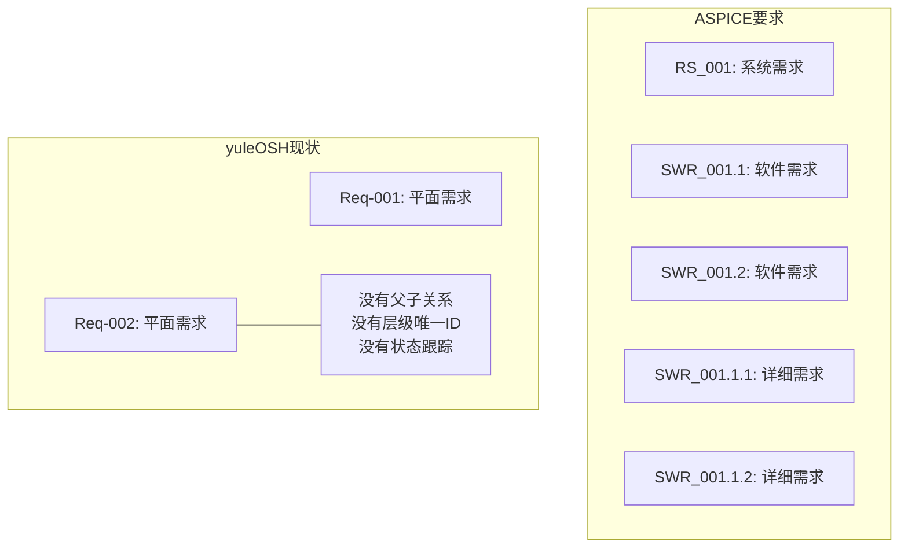

# yuleOSH ASPICE V-Model 质量架构分析 — 小马 🐴

> **分析范围**: ASPICE V-Model 左半侧 — SYS.3 → SWE.1 → SWE.2 → SWE.3 → SWE.4
> **分析对象**: yuleOSH v0.2.0 (2026-06-08)
> **作者**: 小马 🐴 (质量架构师)
> **对标工具**: Codebeamer / Polarion / ReQtest / JAMA

---

## 📐 ASPICE V-Model 左半侧现状总览

| ASPICE 过程 | yuleOSH 覆盖 | 成熟度 | 关键缺失 |
|:-----------|:-----------|:------:|:---------|
| SYS.1/SYS.2 需求挖掘 | ❌ 未覆盖 | - | 无 Stakeholder 需求捕获、无需求分级 (如 ISO 26262 ASIL) |
| SYS.3 系统需求定义 | ✅ 部分覆盖 | P1 | 需求树无层级 (只有平面 Req-XXX)、无需求 ID 规范、无状态跟踪 |
| SYS.4/SYS.5 系统架构 | ✅ 基础覆盖 | P1 | ADR 由 LLM 生成但无结构化模板、无架构合规检查 |
| SWE.1 软件需求分析 | ⚠️ 基础覆盖 | P2 | 没有从系统需求到软件需求的分解、没有软件需求专有属性 |
| SWE.2 软件架构设计 | ✅ 基础覆盖 | P1 | 与 SYS.4 未明确区分、缺少接口定义和运行时视图 |
| SWE.3 详细设计与单元构建 | ✅ Pipeline 覆盖 | P2 | LLM 生成开发计划但无结构化 design spec 输出 |
| SWE.4 软件单元验证 (测试规划) | ⚠️ 缺失 | P0 🚨 | **Pipeline 中没有"测试规划"步骤！** 测试用例与需求无显式双向追溯 |

---

## 1. 📋 需求管理 — 需求树层级分析

### 现状
当前 `docs/spec.md` 中的需求结构是完全平面的：
```
### Req-001: Agent 驱动的开发流水线
### Req-002: 需求管理
### Req-003: 代码审查与 Agent 矩阵
### Req-004: CI/CD 三层流水线
### Req-005: 追溯与证据链
### Req-006: 多端接入
### Req-007: 多租户 SaaS 架构
```
每个 Req-XXX 只有 `SHALL/SHOULD/MAY` 列表 + `Reason`，无层级。

### ASPICE SYS.3 要求
- 需求必须有唯一的持久化标识符（不仅仅是 Req-001 这种相对编号）
- 需求必须有层级（系统级 → 子系统级 → 功能级）
- 需求必须有属性和状态（Proposed → Approved → Implemented → Verified）
- 需求必须有清晰的"父子关系"

### 差距 (P0)



### 🎯 建议

**P0: 引入需求 ID 规范和层级结构**

```
# 系统需求 (SYS-level)
## RS-001: Agent 驱动的开发流水线
  - 子需求: SWR-001.1 流水线编排
  - 子需求: SWR-001.2 AI Agent 接口
  - 子需求: SWR-001.3 状态管理

# 软件需求 (SW-level)
## SWR-001.1: 流水线编排
  - SHALL: 支持 9 步流水线
  - Status: Approved
  - 关联父需求: RS-001
```

具体格式：
```
### RS-001: {title}
- Type: SYS | SW | FEATURE | SCENARIO
- Status: Proposed | Approved | Implemented | Verified
- Priority: P0 | P1 | P2
- Parent: (null for top-level)
- SHALL: ...
```

修改 `src/spec/validate.py` 的 `SpecRequirement` 类，增加 `req_id`、`status`、`parent`、`level` 字段。

**P1: 需求状态跟踪**

在 `validate.py` 中增加需求状态校验：
- 强类型：PROPOSED / APPROVED / IMPLEMENTED / VERIFIED / OBSOLETE
- 每个需求必须有非 PROPOSED 状态才可进入 Pipeline
- 状态迁移规则：PROPOSED → APPROVED → IMPLEMENTED → VERIFIED

**P2: 需求属性插件化**

允许用户扩展自定义属性（如 ASIL 等级、安全关键性、安全等级 ISO 26262）

---

## 2. 🔗 Spec 契约层 — SHALL/SHOULD/MAY 严谨性

### 现状
OpenSpec 在语法层面已经相当规整：
- SHALL/SHOULD/MAY 严格区分（RFC 2119 合规）
- GIVEN/WHEN/THEN 场景定义完整
- 覆盖评分（score）基于：SHALL 权重 40% + Reason 权重 20% + 场景完整性 40%

### 优点 👍
- `_compute_coverage()` 中的权重计算合理
- `validate_spec()` 精确检测：无 SHALL 的 ERROR、无 Reason 的 WARN、场景不完整的 ERROR
- 支持 `--json` 输出，供 Pipeline 消费

### 差距

**P1: 验收矩阵未与需求建立双向追溯**

现状验收矩阵 `v0.2.0-acceptance-matrix.md` 是以"验证项"为纬度的表格：
```
| 1.1 | 支持 OpenAI 兼容 API | 代码审查 + 单元测试 | ✅ PASS |
```
但**没有标注**这些验收项对应哪些 `RS-XXX` / `SWR-XXX` 需求。

ASPICE 要求：
> 每个需求必须追溯到至少一个验证方法（Test / Analysis / Review / Inspection）

**P1: 缺少 SAL/SHOULD 区分验证方法的属性**

在 `SpecRequirement` 中增加 `verification_method` 属性：
```
### RS-001
- SHALL: support pipeline orchestration
  - Verification: Test (specific test_*.py)
- SHOULD: support streaming
  - Verification: Review
```

**P1: 当前验收矩阵是手写 Markdown 表格**

v0.2.0-acceptance-matrix.md 是手写的。需要在 Pipeline 中增加**自动验收矩阵生成**步骤（在 final-report 之后），从 spec + test 映射自动生成。

### 🎯 建议

**P1: 将验收矩阵纳入 Evidence Engine 自动生成**

在 `src/evidence/pack.py` 中增加 `generate_acceptance_matrix()`：
```
- 遍历每个 SpecRequirement
- 遍历每个 SHALL 语句
- 自动匹配 tests/ 目录下的相关性测试
- 输出格式：| Req ID | SHALL | 验证方法 | 状态 |
```

**P2: 引入"验证方法"属性枚举**

在 spec 解析器中支持可选 `Verification:` 前缀：
```
- SHALL: support X
  Verification: Test -> test_pipeline_orchestration.py
```

---

## 3. 🔄 变更管理 — spec-delta 机制分析

### 现状
`src/spec/diff.py` 实现了基础的 spec-diff：
- 比较两个 OpenSpec 文件的 requirement name 和 SHALL 内容
- 输出 ADDED / REMOVED / MODIFIED 三类变更

```python
def diff_specs(old_path: str, new_path: str) -> dict:
    # 只做了粗略的 name-level 比较
    # 没有：
    #   ✗ 变更影响分析（这个变更会影响哪些 SWE.x）
    #   ✗ 回传机制（变更是否触发下游重新验证）
    #   ✗ 变更关联的测试用例更新建议
```

### ASPICE 要求 (SYS.3 → SWE.4 变更回传)

V-Model 中的变更管理是一个**双向回传链**：

```
SYS.3 需求变更
  ↓ (changelog)
SWE.1 软件需求更新
  ↓
SWE.2 架构调整
  ↓
SWE.3 详细设计更新
  ↓
SWE.4 测试用例更新
  ↓
SWE.5 单元测试重新执行 ← V-Model 右半侧
```

当前 spec-diff 只能检测变更，但**不会建议受影响的下游制品**。

### 差距

| 能力 | 状态 | 说明 |
|------|:----:|:-----|
| 变更检测 | ✅ | diff_specs 基本可用 |
| 影响分析 | ❌ | 没有输出受影响的任务、测试、架构文档 |
| 变更回传 | ❌ | Pipeline 不会因 spec 变更自动重跑下游步骤 |
| 变更历史 | ❌ | 无版本化、无 baselining、无变更批准工作流 |
| 增量验证 | ❌ | 变更触发全量流水线而非增量验证 |

### 🎯 建议

**P0: 在 diff_specs 输出中增加影响分析**

修改 `diff.py` 的返回结构：
```python
# 新增
"impact_analysis": {
    "affected_requirements": ["SWR-001.1", "SWR-001.2"],
    "affected_architecture_components": ["spec-engine", "pipeline-runner"],
    "affected_tests": ["test_spec_engine.py", "test_spec_engine_extended.py"],
    "affected_scenarios": ["变更管理场景"],
    "recommended_actions": [
        "更新 SWR-001.1 的 SHALL 语句",
        "重新运行 test_spec_engine.py",
        "检查架构 ADR-003 是否仍然有效"
    ]
}
```

实现方式：在 `diff.py` 中增加一个**变更影响推理**模块，基于文件名匹配 (`spec*` → spec 相关) 和关键词匹配 (`architecture*` → arch 相关)。

**P1: Pipeline 自动检测 spec 变更并触发 delta 运行**

当 pipeline 启动时：
1. 检查 git diff，看 spec 文件是否变更
2. 如果有变更 → 调用 `diff_specs(old, new)` → 输出影响分析
3. 根据影响分析自动决定哪些 pipeline 步骤需要 re-run

```python
def should_rerun_step(step_key: str, impact: dict) -> bool:
    """基于变更影响分析决定是否重跑某步骤."""
    if "spec" in impact["affected_architecture_components"]:
        return True  # spec-engine 相关步骤都要重跑
    if step_key == "architecture" and impact["is_structural_change"]:
        return True  # 结构性变更 → 架构重审
    return False
```

**P2: 需求基线 (Baselining)**

引入 `.osh/spec-baseline/` 目录，每次 pipeline run 前自动备份 spec：
```
.osh/spec-baseline/
├── v1-spec.md          # 基线版本
├── v2-spec.md
└── baseline-index.json   # 版本历史
```

---

## 4. 🧪 测试规划 — V-Model 左半侧的 SWE.4 分析

### 现状

Pipeline 9 步中**没有独立的测试规划步骤**：

```
✅ spec-check       (小明)
✅ super-analysis   (小明) 
✅ prd              (Hermes)
✅ internal-review  (小明)
✅ architecture     (Claude)
✅ development      (Claude)
✅ self-test        (Claude)    ← 实际是执行测试，不是规划
✅ code-review      (Hermes)
✅ final-report     (小明)
```

**🚨 关键缺失：Pipeline 中完全没有 SWE.4 对应的 "test-planning" 步骤！**

ASPICE V-Model 的 SWE.4 要求：
> 在单元验证之前，必须创建单元验证计划/规范
> - 测试用例必须追溯到需求
> - 测试用例必须明确输入、预期输出和通过/失败标准
> - 测试覆盖率必须被评估

### 现状的测试覆盖分析

`test_spec_engine.py` 只有 4 个测试：
```python
def test_parse_basic_spec(): ...
def test_validate_clean_spec(): ...
def test_parse_requirement_structure(): ...
def test_parse_scenario_structure(): ...
```

这些测试验证了 spec 引擎是否能正确解析，但**没有验证 spec 引擎是否正确实现了 spec.md 中的每一个 SHALL 语句**。

例如，`spec.md` 中的 `Req-005` 有 3 个 SHALL：
```
- The system SHALL generate a traceability matrix
- The system SHALL archive all agent review records as JSON evidence
- The system SHALL export a compliance pack for ASPICE audit
```

但 `test_evidence_engine.py` 只有 4 个测试，**没有测试"traceability matrix 是否包含了所有 requirements"**。

### 🎯 建议

**P0: 在 Pipeline 中新增 Test Planning 步骤**

在 `development`（Step 5）之后、`self-test`（Step 6）之前，插入一个 **test-planning** 步骤：

```
├── development        (Claude)    ← 当前 Step 5
├── test-planning      (小马/Hermes)  ← 🔥 NEW!
├── self-test          (Claude)    ← 当前 Step 6 (执行)
```

`test-planning` 步骤的输出：
```markdown
# Test Plan: {session-name}

## 1. 测试策略
- 单元测试范围：spec-engine（5 个关键函数）
- 集成测试范围：Pipeline 端到端
- E2E 测试范围：CLI 全流程

## 2. 测试用例 → 需求追溯表
| 需求 ID | SHALL 描述 | 测试用例 | 状态 |
|---------|-----------|---------|:----:|
| RS-001   | SHALL support pipeline | test_e2e_pipeline_run | Planned |
| RS-001.1 | SHALL support 9 steps | test_pipeline_all_steps | Planned |
| RS-005   | SHALL generate traceability | test_traceability_contains_all | Planned |

## 3. 覆盖率目标
- 行覆盖：≥80%
- 分支覆盖：≥70%
- 需求覆盖：100%（每个 SHALL 至少一个正向测试用例）
```

实现方式：在 Pipeline 中新增 `step_test_planning`，调用 LLM 从 spec + architecture + development plan 生成测试计划 Markdown。

**P1: Test 用例自动与需求建立双向追溯**

在现有 `tests/` 目录结构上增加追溯标注：
```python
# tests/test_spec_engine.py

def test_parse_basic_spec():
    """RS-001: Basic spec parsing test.
    
    Covers: RS-001 (SHALL support OpenSpec format)
            SWR-001.1 (SHALL parse SHALL/SHOULD/MAY)
    """
    ...
```

**P1: 在 Evidence Engine 中增加"需求-测试追溯"完整性检查**

```python
def check_requirement_test_coverage(requirements, test_files) -> dict:
    """检查每个 SHALL 是否至少有一个对应的测试函数。"""
    # 解析每个 test_*.py 的 docstring 中的 "Covers:" 标记
    # 与 spec 中的每个 SHALL 做匹配
    # 返回未被覆盖的 SHALL 列表
```

**P2: 在 Coverage Guardian 中增加"需求覆盖"（reQ 覆盖而非仅仅是行覆盖）**

修改覆盖率检查，增加需求覆盖率指标：
- 当前：行覆盖 ≥ 38%（MVP 阈值）
- 建议增加：需求覆盖 ≥ 100%（每个 SHALL 至少被一个 test 引用的比例）

---

## 5. ⚠️ 合规差距 — 行业对标

### 行业最佳实践对比如下

| 能力域 | Codebeamer | Polarion | ReQtest | yuleOSH v0.2.0 | 差距 |
|--------|:---------:|:--------:|:-------:|:--------------:|:----:|
| **需求层级** (SYS→SW→Detail) | ✅ 4+ 层 | ✅ 任意深度 | ✅ 3 层 | ❌ 平面 | 🔴 P0 |
| **需求 ID 规范** | ✅ 自动生成 | ✅ 自动 | ✅ 模板 | ⚠️ 人工手写 Req-XXX | 🟡 P1 |
| **需求状态工作流** | ✅ 完整 | ✅ 完整 | ✅ 基础 | ❌ 无 | 🔴 P0 |
| **变更影响分析** | ✅ 自动 | ✅ 自动 | ✅ 手动 | ⚠️ 仅 diff | 🔴 P0 |
| **双向追溯** (Req↔Design↔Code↔Test) | ✅ 自动 | ✅ 自动 | ✅ 自动 | ⚠️ 单向 (Req→Code) | 🔴 P0 |
| **测试规划 (SWE.4)** | ✅ 内置 | ✅ 内置 | ✅ 内置 | ❌ 无 | 🔴 P0 |
| **测试用例-需求映射** | ✅ 自动 | ✅ 自动 | ✅ 自动 | ❌ 无 | 🔴 P0 |
| **审查证据链** | ✅ 完整 | ✅ 完整 | ✅ 基础 | ✅ 基础 (JSON 存储) | 🟢 好 |
| **合规包导出** | ✅ 模板化 | ✅ 模板化 | ✅ 基础 | ✅ 基础 (ZIP) | 🟢 好 |
| **自动化门禁** | ⚠️ 自定义 | ✅ Rules | ⚠️ 自定义 | ✅ 3 层 CI + Agent | 🟢 强 |
| **AI 辅助** | ❌ 无 | ❌ 无 | ❌ 无 | ✅ LLM Pipeline | 🏆 领先 |

### 总结差距

| 优先级 | 差距 | 影响 |
|:------:|:-----|:-----|
| 🔴 P0 | **无测试规划步骤 (SWE.4)** | V-Model 左半侧核心缺失，无法认证 |
| 🔴 P0 | **无需求层级和状态跟踪** | 无法通过 ASPICE SYS.3 审计 |
| 🔴 P0 | **变更影响分析不完整** | 变更回传链断连 |
| 🔴 P0 | **无需求-测试双向追溯** | SWE.4/SWE.5 追溯不可审计 |
| 🟡 P1 | **无需求 ID 生成规范** | 长期维护困难 |
| 🟡 P1 | **验收矩阵手工维护** | 验收矩阵与 spec 不同步 |
| 🟡 P1 | **hermes-review 不阻断 pipeline** | critical 发现可被忽视 |

### yuleOSH 的独特优势

| 优势 | 说明 |
|:----|:-----|
| 🏆 **AI Pipeline 全程自动** | Codebeamer/Polarion 没有 LLM 驱动的自动分析流 |
| 🏆 **3 层 CI 嵌入式专属** | 交叉编译 + MISRA 门禁，传统 ALM 不提供 |
| 🏆 **Agent 审查矩阵** | 4 种 reviewer 按任务类型路由，行业首创 |
| 🏆 **零依赖 LLM Client** | 仅 urllib，嵌入式团队可轻松部署 |
| 🏆 **证据包自动生成** | compliance-pack.zip 直接输出给审计 |

---

## 6. 🎯 行业对标建议 — "行业最好"的 Spec 层+质量门禁设计

### 6.1 Spec 层架构设计（理想的规范格式）

yuleOSH 应成为 **"可编程的合规引擎"**，而不仅仅是又一个文档管理工具。

```
┌──────────────────────────────────────────────────┐
│               yuleOSH Spec Layer                   │
├───────────────┬───────────────────┬────────────────┤
│   结构化需求    │   约束规则引擎     │   质量门禁     │
│  (层级+ID+状态) │  (RFC 2119 + 扩展) │ (自动+Agent)  │
├───────────────┼───────────────────┼────────────────┤
│ RS-001 (SYS)  │ SHALL → must-pass  │ CI Layer 1    │
│  ├─ SWR-001.1 │ SHOULD → warn      │  → 单元+覆盖   │
│  ├─ SWR-001.2 │ MAY → optional     │ CI Layer 2    │
│  └─ SWR-001.3 │                   │  → 集成+静态   │
│ RS-002 (SYS)  │ Value: 30 + 50 + 20 │ CI Layer 3    │
│  ├─ SWR-002.1 │ (customizable)    │  → 系统+证据   │
│               │                   │ Agent Review   │
│               │                   │  → 4 个 reviewer │
└───────────────┴───────────────────┴────────────────┘
```

### 6.2 理想质量门禁矩阵

**P0 门禁 — 阻塞级**（不能跳过）

| 门禁 | 触发时机 | 通过条件 | 对应 ASPICE |
|:----|:--------|:--------|:-----------|
| Spec 完整性检查 | Pipeline 入口 | 100% SHALL + Reason + 场景 | SYS.3 |
| 需求状态检查 | Pipeline 入口 | 所有需求非 PROPOSED | SYS.3 |
| 需求-测试追溯 | test-planning 后 | 每个 SHALL 都有 test 引用 | SWE.4 |
| 行覆盖检查 | CI Layer 1 | ≥80% 行覆盖 | SWE.5 |
| AI 审查 critical | hermes-review | 无 critical 发现 | SWE.3/SWE.4 |
| 合规证据完整性 | Release | 所有 artifact 存在 | 全部 |

**P1 门禁 — 警告级**（允许通过但标记）

| 门禁 | 触发时机 | 处理方式 |
|:----|:--------|:--------|
| 变更影响未确认 | spec-diff 后 | Markdown 报告 + 人工确认 |
| 需求状态未更新 | 每次 commit | Warn 但继续 |
| 条件覆盖率不足 | CI Layer 1 | Warn 但继续 |
| 分支覆盖不足 | CI Layer 1 | Warn 但继续 |

### 6.3 增量验证策略（规模化关键）

**当前问题**：任何变更都跑全量流水线 → 扩展到上百需求时不可持续。

**建议**：基于变更影响分析的增量验证。

```python
def compute_impact_set(diff_result: dict, spec_repo: dict) -> set:
    """计算变更影响的最小验证集。
    
    输入: diff_specs(old, new) 的输出
    输出: 需要重新验证的 item 集合
    
    策略:
    - SHALL 变更 → 重跑该需求的全部测试
    - SHOULD 变更 → 重跑该需求的关联测试（如有）
    - 新增需求 → 全量验证该需求
    - 删除需求 → 验证删除不影响其他需求
    - Reason 变更 → 不需要重跑测试（仅文档更新）
    """
    impact = set()
    for mod in diff_result["modified_requirements"]:
        for change in mod["changes"]:
            if change.startswith("+ SHALL") or change.startswith("- SHALL"):
                impact.add(f"TEST:{mod['name']}")  # 需要重新验证该需求
                impact.add(f"ARCH:{mod['name']}")  # 需要检查架构影响
            elif change.startswith("+ SHOULD") or change.startswith("- SHOULD"):
                impact.add(f"TEST:{mod['name']}")
    for added in diff_result["added_requirements"]:
        impact.add(f"FULL:{added}")  # 新增需求需要全量验证
    return impact
```

### 6.4 推荐的 Sprint 路线图

| Sprint | 重点 | 产出 |
|--------|:----|:-----|
| **v0.3.0** (当前) | **SWE.4 测试规划 + 需求层级** | Pipeline 新增 test-planning 步骤，需求支持层级 ID |
| **v0.4.0** | **变更影响分析 + 增量验证** | diff_specs 返回 impact_analysis + pipeline 增量重跑 |
| **v0.5.0** | **需求状态工作流 + 双向追溯** | Proposed→Approved→... + 测试→需求回标 |
| **v0.6.0** | **自动验收矩阵 + 合规审计包模板化** | 证据包支持客户定制模板 |
| **v1.0.0** | **基于 diff 的部分验证 + 规模化** | 百级需求性能保障 |

---

## 7. 📝 优先级汇总

### 🔴 P0 — 下一 Sprint 必须修复

| # | 项目 | 所属 ASPICE | 当前成本 |
|:--|:-----|:-----------|:--------|
| 1 | Pipeline 新增 test-planning 步骤 | SWE.4 | ~2 天（新增 step + prompt） |
| 2 | 需求层级 ID 规范 + 父子关系 | SYS.3/SWE.1 | ~1 天（修改 SpecRequirement） |
| 3 | spec-diff 增加 impact_analysis | SYS.3→SWE.4 | ~2 天（Impact 推理模块） |
| 4 | 需求状态跟踪 (Proposed→Approved→...) | SYS.3 | ~1 天（validate.py 增加校验） |
| 5 | 需求-测试双向追溯（每个 SHALL→至少一个 test） | SWE.4/SWE.5 | ~3 天（evidence engine 增强） |

### 🟡 P1 — 本季度内

| # | 项目 | 成本 |
|:--|:-----|:----|
| 6 | 验收矩阵自动生成（Evidence Engine 集成） | ~2 天 |
| 7 | SHALL 验证方法属性 (Verification: Test/Review/Inspection) | ~1 天 |
| 8 | hermes-review critical 发现阻断 pipeline | ~0.5 天 |
| 9 | Pipeline 基于变更检测自动决定增量重跑 | ~2 天 |
| 10 | 覆盖 Guardian 增加"需求覆盖率"指标 | ~1 天 |

### 🟢 P2 — 锦上添花

| # | 项目 | 成本 |
|:--|:-----|:----|
| 11 | 需求基线（baselining + 版本化） | ~2 天 |
| 12 | 需求属性插件化（ASIL/安全等级等） | ~3 天 |
| 13 | 增量验证策略（基于影响集的只跑部分验证） | ~3 天 |
| 14 | 合规包模板化（支持客户自定义审计模板） | ~2 天 |
| 15 | Token 用量预估与智能分块 | ~1 天 |

---

## 8. 💭 最终评估

**yuleOSH v0.2.0 在"V-Model 左半侧的全链路 AI 自动化"这一独特定位上已经领先于传统 ALM 工具**（Codebeamer/Polarion 无 AI 集成）。

但**在 ASPICE 合规基础的"需求管理规范"和"测试规划完整性"上仍有重大缺口**。

如果把 ASPICE 合规度从 1→5 分打分：

| ASPICE 过程 | yuleOSH v0.2.0 | 修复 P0 后 |
|:-----------|:--------------:|:----------:|
| SYS.3 需求定义 | **2/5** ⚠️ | 4/5 ✅ |
| SWE.1 需求分析 | **2/5** ⚠️ | 4/5 ✅ |
| SWE.2 架构设计 | **3/5** 🟡 | 3/5 🟡 |
| SWE.3 详细设计 | **2/5** ⚠️ | 3/5 🟡 |
| SWE.4 测试规划 | **1/5** ❌ | 4/5 ✅ (关键提升) |
| 变更管理 | **2/5** ⚠️ | 4/5 ✅ |
| 双向追溯 | **2/5** ⚠️ | 4/5 ✅ |

**结论**：修复上述 P0 项后，yuleOSH 的 ASPICE V-Model 左半侧成熟度可从 2/5 提升到 **4/5**，达到"可用于实际认证准备"的水平。

> 🐴 **一句总结：yuleOSH 的 AI Pipeline 是行业领先的，但 V-Model 的"左半边骨架"（需求树 + 测试规划）还需要加固才能做真正的 ASPICE 合规平台。**
